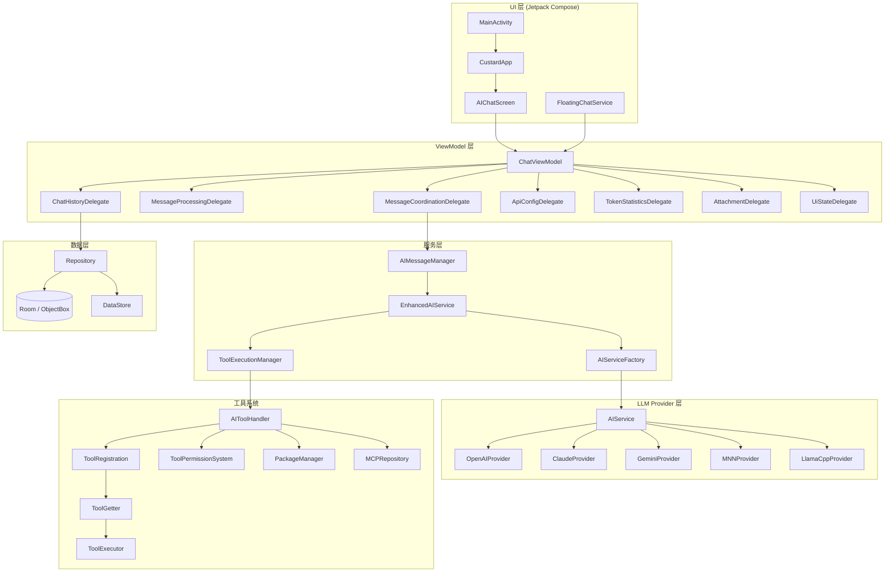
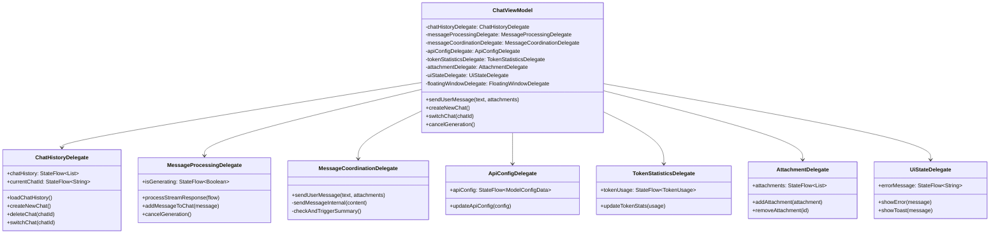
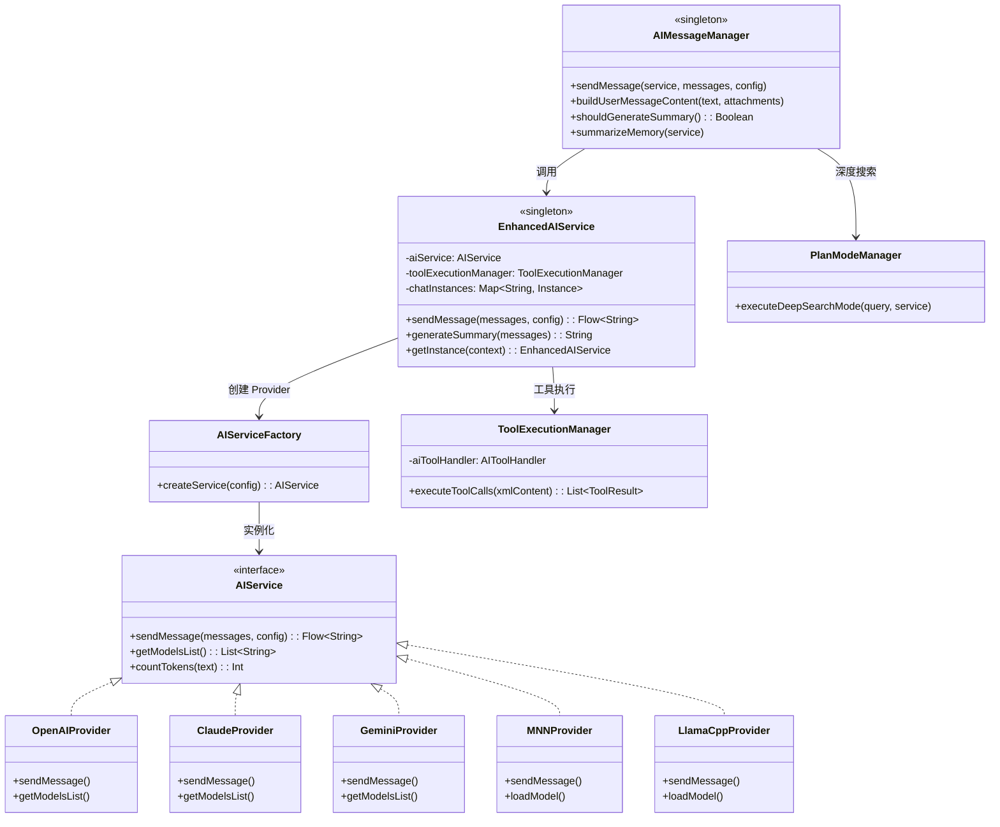
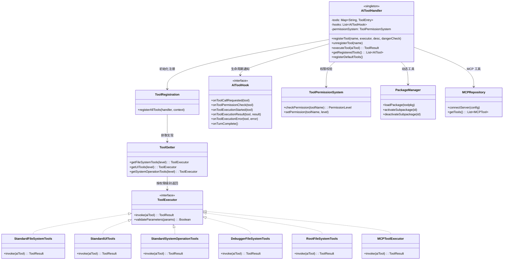
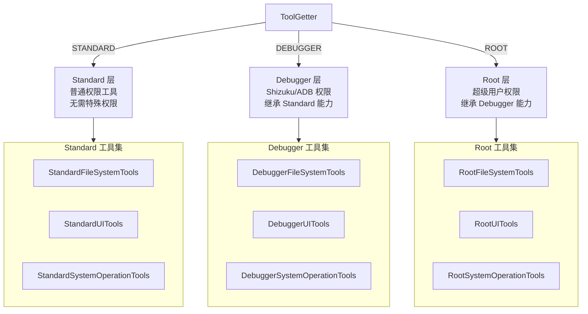
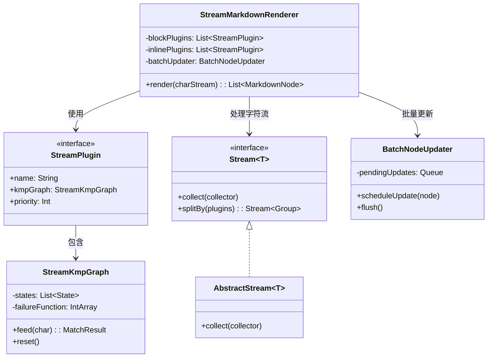
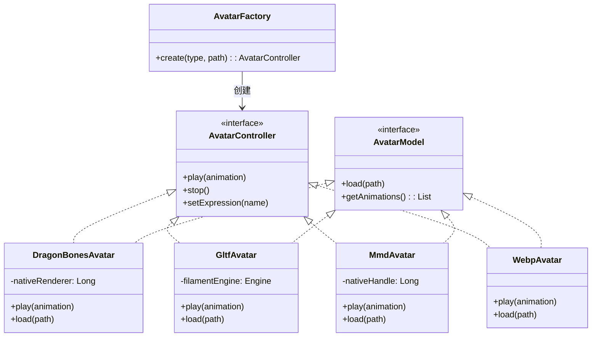
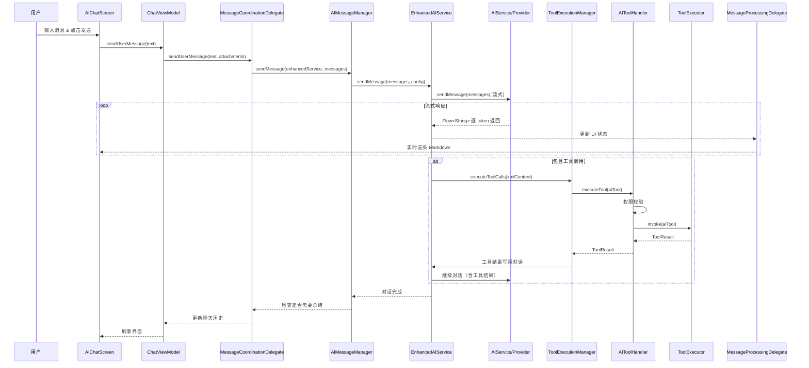

# 核心类图

本文档描述奶黄包（Custard）项目中核心类的职责与引用关系。

## 1. 整体架构总览

## 2. ViewModel 委托体系

`ChatViewModel` 采用多委托模式将复杂逻辑拆分到独立的 Delegate 类中，每个 Delegate 负责一个明确的职责域。

## 3. AI 服务链路

从用户输入到 LLM 响应的完整服务调用链。

## 4. 工具系统

工具注册、权限校验与执行的完整架构。

## 5. 工具权限分层

工具实现按权限级别分为三层，通过 `ToolGetter` 动态选择。

## 6. 流式渲染引擎

基于 KMP 算法的流式 Markdown 渲染架构。

## 7. 虚拟形象系统

支持多种格式的虚拟形象渲染。

## 8. 数据流全景

从用户输入到最终 UI 渲染的完整数据流。

