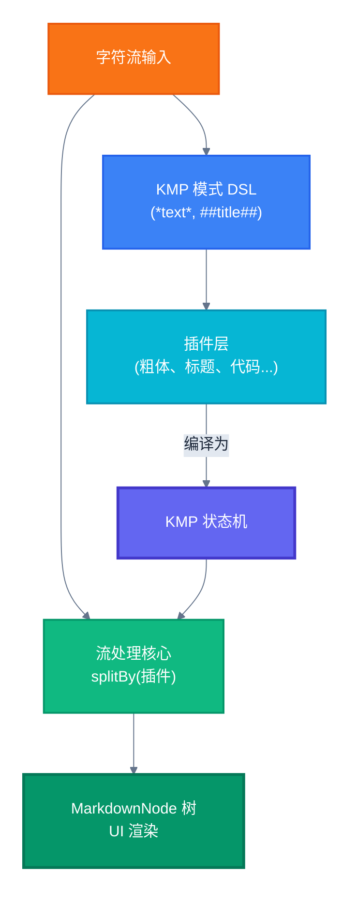

# 高性能流式 Markdown 渲染引擎：架构与优势

本文档旨在深入解析项目中所使用的高性能、基于 KMP 算法的流式 Markdown 渲染引擎。该引擎专为需要实时、增量渲染 Markdown 内容的场景设计，例如展示大型语言模型（LLM）的流式响应，能够实现优雅的“打字机”效果，同时保持出色的性能和极低的内存占用。

## 核心优势

该渲染引擎的设计结合了多种先进思想，使其在处理动态 Markdown 数据流时具备显著优势。

### 1. 真·流式处理：低内存，高实时性

与传统的一次性加载整个文档进行解析的渲染器不同，本引擎从设计之初就基于`Stream<Char>`（字符流）进行工作。

-   **逐字符处理**：数据以单个字符的形式流入，解析器实时处理，无需等待整个文档加载完毕。
-   **极低内存占用**：非常适合处理大型 Markdown 文件或无界限的网络数据流，因为它不需要将全部内容缓存到内存中。
-   **实时渲染**：能够将解析和渲染同步进行，内容一到达即可显示在屏幕上，为用户带来即时反馈。

### 2. 高效 KMP 算法：线性时间复杂度的模式匹配

引擎的核心是`StreamKmpGraph`，一个基于 [Knuth-Morris-Pratt (KMP)](https://en.wikipedia.org/wiki/Knuth–Morris–Pratt_algorithm) 算法的模式匹配状态机。

-   **避免回溯**：与传统正则表达式在匹配失败时需要大量回溯不同，KMP 算法利用预计算的失败函数进行高效的状态转移，解析性能稳定。
-   **线性时间复杂度**：对于任意长度的输入，解析时间复杂度为 O(n)，确保了即使在处理长文本时也能保持高速。
-   **强大的 DSL**：通过`kmpPattern`领域特定语言，可以声明式地构建复杂且高效的匹配模式，代码可读性和可维护性俱佳。

### 3. 插件化架构：语法规则高度可扩展

整个解析系统是围绕`StreamPlugin`构建的。每一种 Markdown 语法（如标题、代码块、粗体等）都被实现为一个独立的插件。

-   **关注点分离**：每个插件只负责识别和处理一种特定的语法，逻辑清晰。
-   **高可扩展性**：如果需要支持新的 Markdown 语法（例如自定义的图表语法），只需实现一个新的`StreamPlugin`接口并将其添加到插件列表中，无需修改现有核心解析逻辑。
-   **可组合性**：插件可以被灵活地组合成不同的列表（例如，块级插件列表和内联插件列表），以适应不同的解析需求。

### 4. 两阶段嵌套解析：精准处理复杂 Markdown 结构

为了正确处理 Markdown 的嵌套语法（如列表中包含加粗的文本），引擎采用了两阶段解析策略：

1.  **块级解析**：首先，使用标题、列表、代码块等块级插件将整个字符流分割成多个独立的块。
2.  **内联解析**：然后，对每个块的内容流，再使用粗体、斜体、链接等内联插件进行二次分割和解析。

这种分而治之的策略确保了即使是复杂的嵌套格式也能被准确地识别和渲染。

### 5. 智能 UI 批量更新：保障流畅的增量渲染体验

在 UI 层面，`StreamMarkdownRenderer` 使用了多种优化手段来确保流畅的“打字机”效果，即使数据流速度很快。

-   **批量更新**：通过`BatchNodeUpdater`，渲染器不会在每次接收到新字符时都立即触发 UI 重绘，而是将短时间内的多次更新合并为一次批量操作，大大减少了重组（Recomposition）的开销。
-   **状态驱动的 UI**：利用 Jetpack Compose 的`SnapshotStateList`和`key`，只有发生变化的 UI 节点才会被更新，实现了高效的增量渲染。
-   **优雅的动画**：新出现的节点会以平滑的淡入动画显示，提升了视觉体验。

## 架构图

下图展示了从原始字符流输入到最终 UI 渲染的完整数据处理流程。



## 工作流程解析

### 1. 模式定义阶段（编译时）
每种 Markdown 语法都通过 `kmpPattern` DSL 定义匹配规则：
```kotlin
// 粗体模式：*content*
kmpPattern {
    char('*')
    group(1) { greedyStar { noneOf('*') } }
    char('*')
}
```
这些模式被编译成高效的 `StreamKmpGraph` 状态机，每个状态机包含：
- **KMP 状态节点**：基于失败函数的快速状态转移
- **二阶段匹配**：KMP 快速定位 + 正则表达式提取捕获组

### 2. 插件初始化
每个 `StreamPlugin`（如 `BoldPlugin`, `HeaderPlugin`）都包装了一个 `StreamKmpGraph`，插件按优先级排序（长模式在前，短模式在后）。

### 3. 流式解析核心 - splitBy 操作

**第一阶段：块级解析**
```kotlin
charStream.splitBy(blockPlugins).collect { blockGroup ->
    // 每个字符都被所有块级插件并行处理
    // KMP 算法确保 O(n) 时间复杂度，无回溯
}
```

**第二阶段：内联解析** 
```kotlin
blockGroup.stream.splitBy(inlinePlugins).collect { inlineGroup ->
    // 对每个块的内容再次进行 KMP 模式匹配
    // 实现嵌套语法的正确解析
}
```

### 4. KMP 算法的工作细节

对于每个输入字符 `c`：
1. **状态转移**：尝试从当前状态通过字符 `c` 转移到下一状态
2. **失败处理**：如果转移失败，使用 KMP 失败函数跳转到合适的回退状态
3. **匹配检测**：到达最终状态时，触发二阶段正则匹配提取捕获组
4. **结果返回**：返回 `Match`（含捕获组）、`InProgress` 或 `NoMatch`

这种设计的关键优势：
- **零回溯**：KMP 算法保证线性时间复杂度，无论输入多复杂
- **实时处理**：字符流入即处理，无需缓冲整个文档
- **精确捕获**：结合正则表达式的捕获组功能，提取结构化数据

### 5. 数据输出
解析结果最终构建成 `MarkdownNode` 树结构，支持实时的流式 UI 渲染，实现流畅的"打字机"效果。
